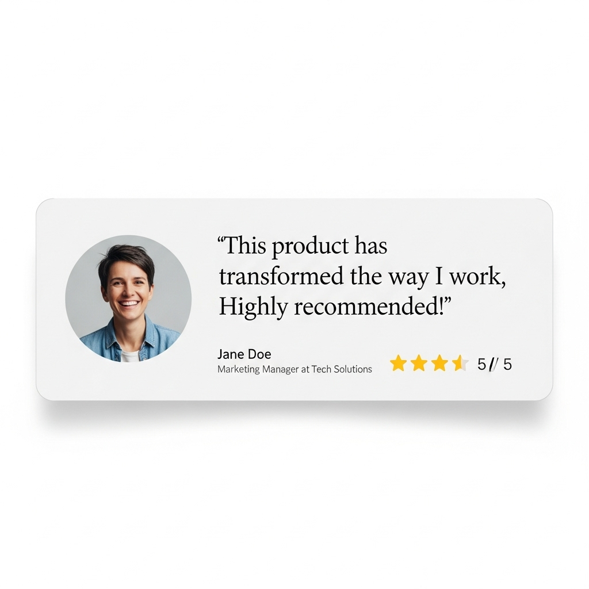
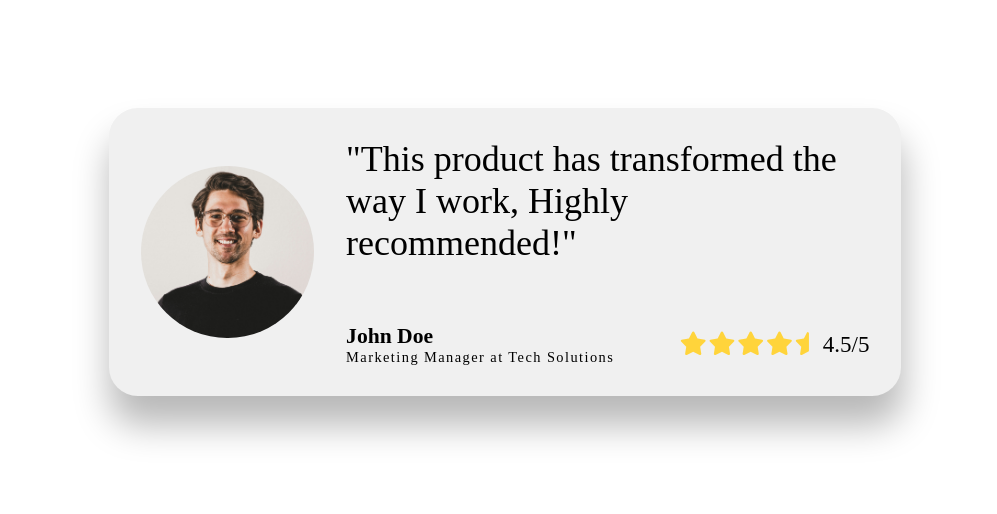

# Testimony card

## 🎯 Objective

*This was the image or concept I used to guide my design.*

## 🚀 My Solution

I'm just starting again with the frontend path, today i use the most basic CSS i know.

*This is the final result of my CSS implementation.*

### 🛠️ Technologies Used

* HTML
* CSS (Flexbox)